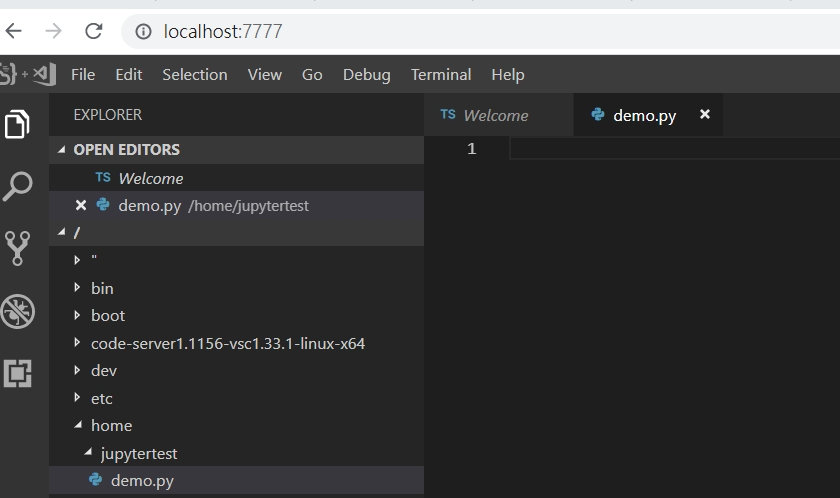
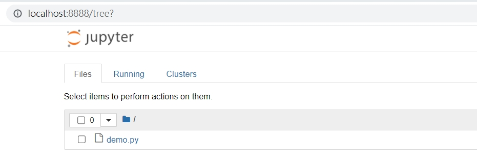
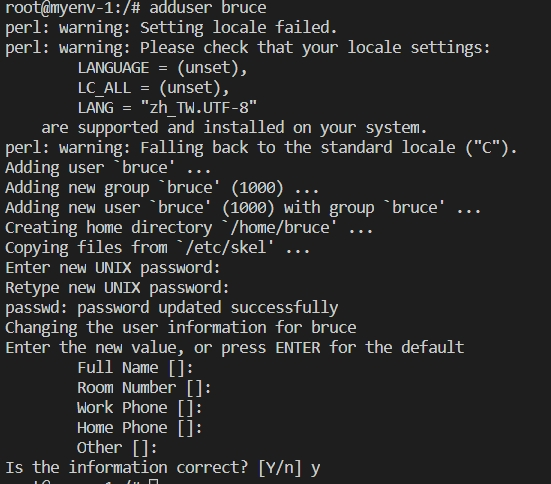

## jupyter & vscode 遠端環境建置
不知道有沒有人有這整情況，剛買了一台頂級電腦，卻無法與其他人分享同一個設備環境的困擾呢，有沒有出門在外，突然想起某靈感，想要遠端操作卻又是用teamviews來撰寫呢?本專案透過docker來實現vscode與jupyter的環境建置，並透過ssh來進入該環境容器裡操作指令。

----
### window

https://docs.docker.com/docker-for-windows/install/

### window(wsl2)
wsl建置 https://docs.microsoft.com/en-us/windows/wsl/install-win10
```
sudo apt-get install docker.io
```

### ubuntu
```
sudo apt-get install docker.io
```

----


### 
```
git clone https://github.com/bruce601080102/docker_vscode_jupter_ssh.git
```
```
cd docker_vscode_jupter_ssh
```


### 建置images
```
docker build -t vsjupyter . --no-cache
```
### 建置容器
```
docker run -tid --restart=always --privileged=true -p 7777:8080 -p 8888:8888 -p 422:22 --name vscode -h myenv-1 vsjupyter
```
----

### VScode

http://localhost:7777/ or 內網:7777


### jupter notebook
資料夾預設在home/jupytertest
http://localhost:8888/ or 內網:8888



----

### ssh
進入vscode，設定sudo權限名稱
```
adduser yourUserName
```


```
su yourUserName
```


#### 到外部終端機輸入使用者名稱與內網ip，即可進入該環境
```
ssh  bruce@192.168.0.11 -p 422
```

#### 下載vscode延伸套件Remote - SSH
即可透過本地vscode進入此環境


### 後記
目前此錯法可以通用於所有環境，未來再補充如何在ubuntu環境下使用nvidia，以及vpn設定，而使用wsl的朋友們，目前不建議安裝docker nvidia，會導致系統時常綠屏。
